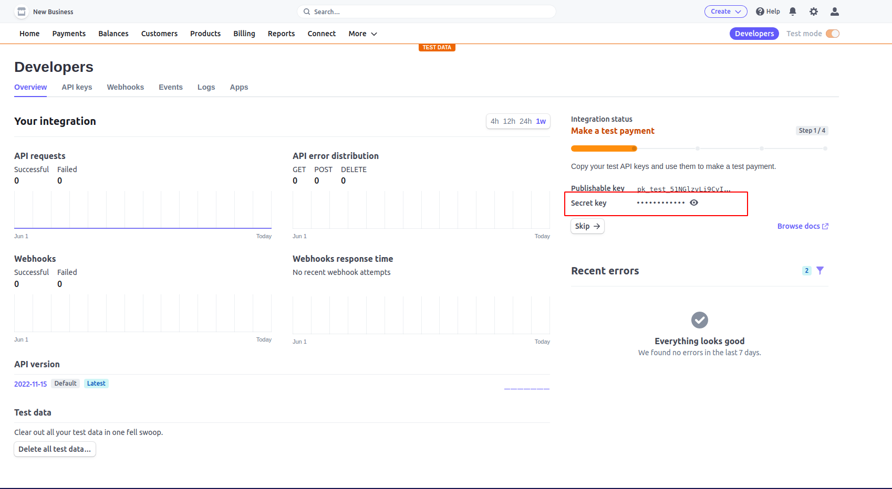
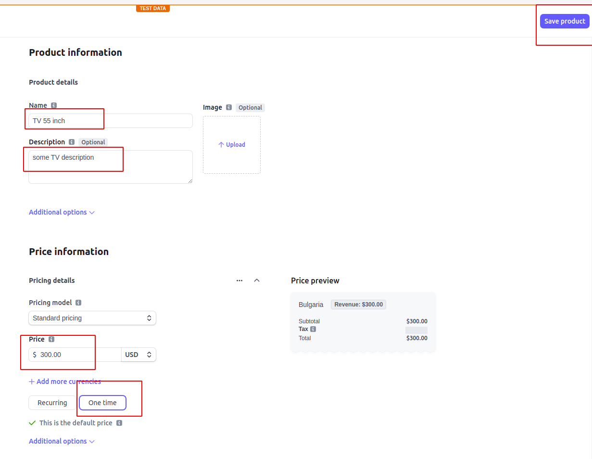
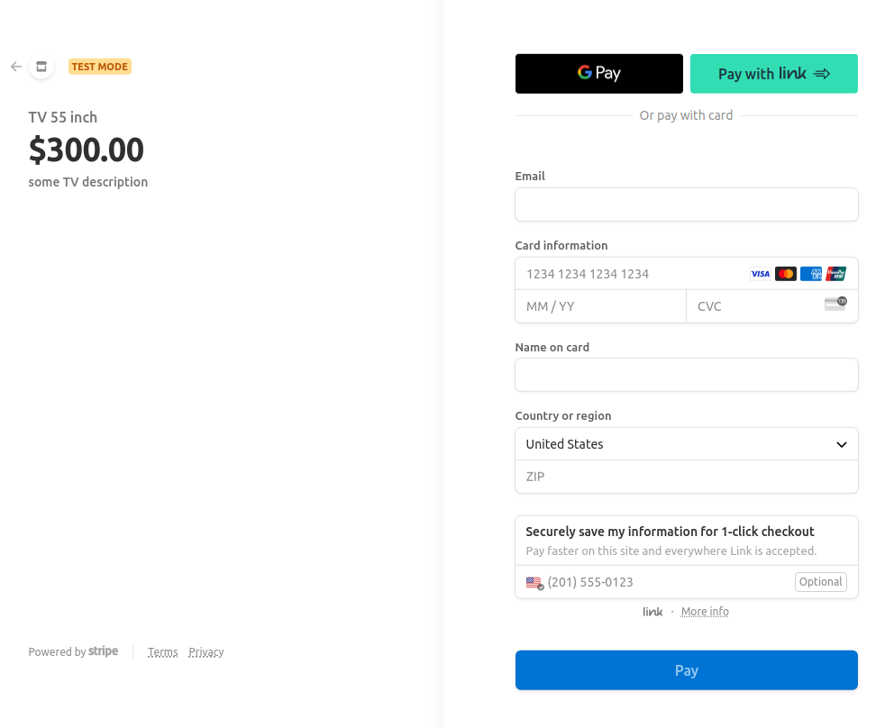
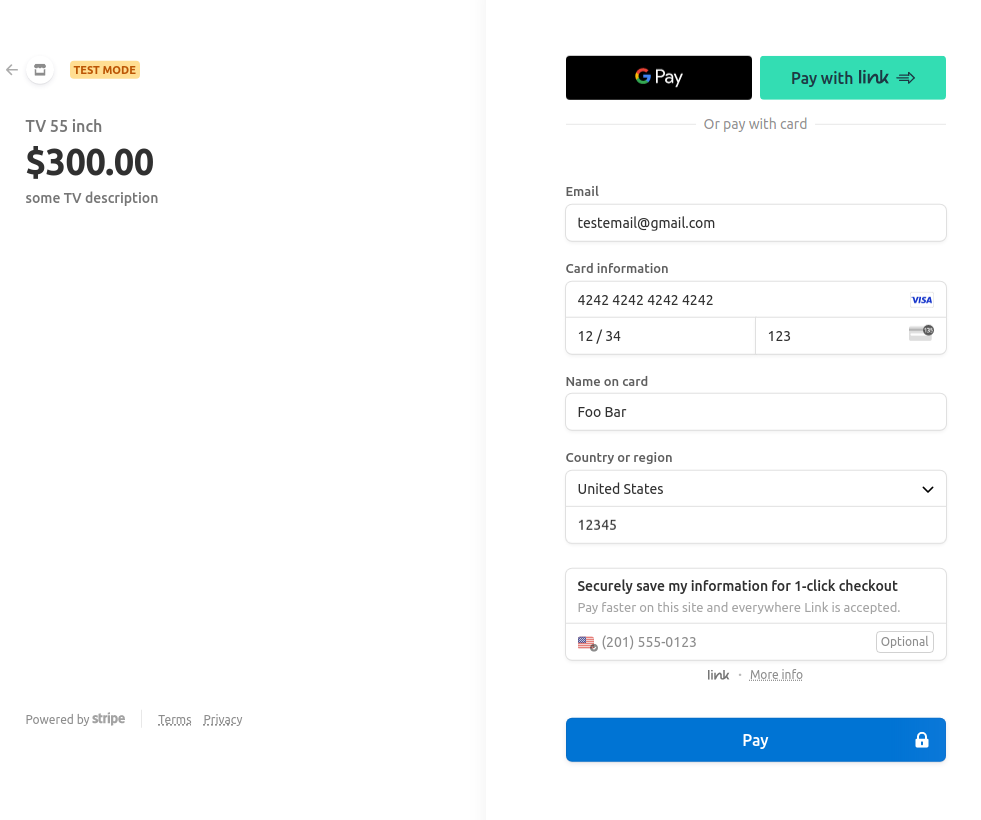
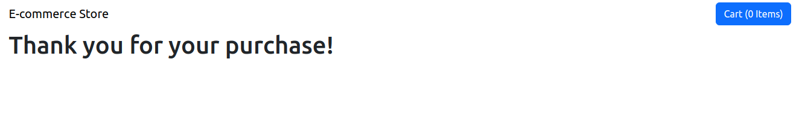
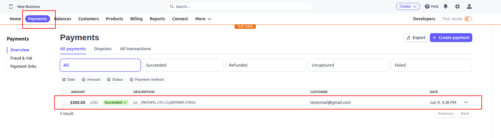

Simple test Back-end with ExpressJS for Stripe Shopping cart Front-end project: https://github.com/sivanov/shoping-cart-reactjs-stripe

## Back-end server

```
npm init --yes
npm i express cors stripe dotenv
```

Example usage for NodeJS from official documentation: https://stripe.com/docs/checkout/quickstart?lang=node

start dev server with 
> npm start


register in Strip and visit  Developer Dashboard:
https://dashboard.stripe.com/test/developers

search for 'Secret key' , copy key and save it to .env file


go to Page 'Products' https://dashboard.stripe.com/test/products?active=true
Add new Product



Copy product key id from Stripe product page


replace in Front-end  project id's with id from Stripe in file src/productStore.js

after we add in  src/NavBar.js checkout async function


Test Visa card info is:
```
VISA card number: 4242 4242 4242 4242
Date: 12 / 34
CVC: 123
Country: United State
ZIP code: 12345
```


Adn after successful paid, we are redirect to out page again


Now go to Stripe Dashboard > Payments and see if transaction exist


Notice: (Optional step) If checkout on Stripe page do not work try to add company name for this demo
https://dashboard.stripe.com/account


